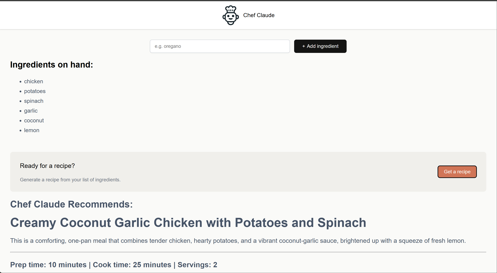

# 👨‍🍳 Chef Claude

**Chef Claude** is an AI-powered recipe generator built with **React** and **Google Gemini**. It allows users to enter ingredients they have available and generates a personalized recipe using AI.

## ✨ Features

* 🥕 Add ingredients dynamically
* 📋 Display a list of available ingredients
* 🤖 Generate personalized recipes using Google Gemini
* ⚡ Asynchronous AI API integration
* 📖 Dynamically render generated recipes
* 🧩 Component-based React architecture
* 🔄 React state management
* 📍 Automatically scroll to the generated recipe
* ♿ Accessible ingredient input
* 🔐 API credentials managed using environment variables

## 🛠️ Tech Stack

* **React**
* **JavaScript**
* **Vite**
* **CSS**
* **Google Gemini API**

## 🧠 React Concepts

This project demonstrates practical use of:

* `useState` for managing ingredients and recipe state
* `useEffect` for responding to recipe generation
* `useRef` for accessing DOM elements
* Form handling with `FormData`
* Async/await
* API integration
* Component composition
* Props and component communication
* Conditional rendering
* Dynamic list rendering
* `scrollIntoView()` for programmatic navigation

## 🔄 How It Works

```text
User enters ingredients
        ↓
Ingredients are added to the list
        ↓
User requests a recipe
        ↓
Ingredients are sent to Google Gemini
        ↓
Gemini generates a recipe
        ↓
Recipe is displayed in the application
```

## 🎮 How to Use

1. Enter an ingredient in the input field.
2. Click **Add ingredient**.
3. Add as many ingredients as you want.
4. Request a recipe using the available ingredients.
5. The ingredients are sent to Google Gemini.
6. The generated recipe is displayed automatically.

## 🔐 Environment Variables

This project requires a Google Gemini API key.

Create a `.env` file in the project root:

```env
VITE_GEMINI_API_KEY=your_api_key_here
```

## 🚀 Getting Started

### Prerequisites

* Node.js
* npm
* Google Gemini API key

### Installation

Clone the repository:

```bash
git clone https://github.com/fuurhan24/chef-claude.git
```

Navigate to the project:

```bash
cd chef-claude
```

Install dependencies:

```bash
npm install
```

Create a `.env` file in the project root and add your Gemini API key:

```env
VITE_GEMINI_API_KEY=your_api_key_here
```

Start the development server:

```bash
npm run dev
```

Open the local URL provided by Vite.

## 📁 Project Structure

```text
Chef-Claude/
│
├── src/
│   ├── components/
│   │   ├── ClaudeRecipe.jsx
│   │   ├── Header.jsx
│   │   ├── IngredientsList.jsx
│   │   └── Main.jsx
│   │
│   ├── images/
│   │   └── chef-claude-icon.png
│   │
│   ├── ai.js
│   ├── App.css
│   ├── App.jsx
│   ├── index.css
│   └── main.jsx
│
├── .env
├── .gitignore
├── .oxlintrc.json
├── index.html
├── package.json
├── package-lock.json
├── README.md
└── vite.config.js
```

## 📸 Preview



## 🔮 Future Improvements

* Remove and edit ingredients
* Add dietary preferences
* Add cuisine selection
* Add cooking time and difficulty options
* Add recipe regeneration
* Save favorite recipes
* Add loading states and animations
* Improve API error and rate-limit handling
* Add recipe images
* Move Gemini API requests to a secure backend

## 📚 Learning

This project was built as part of my journey learning **React and AI integration**.

It provided hands-on practice with React hooks, form handling, asynchronous JavaScript, API integration, component communication, environment variables, and displaying dynamically generated AI content.

---
